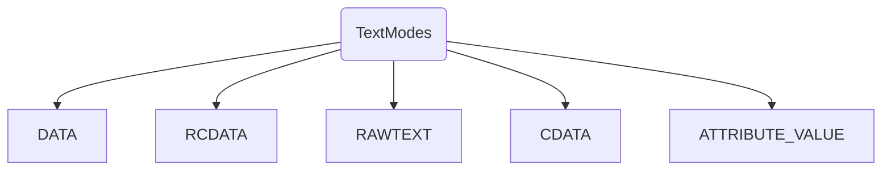
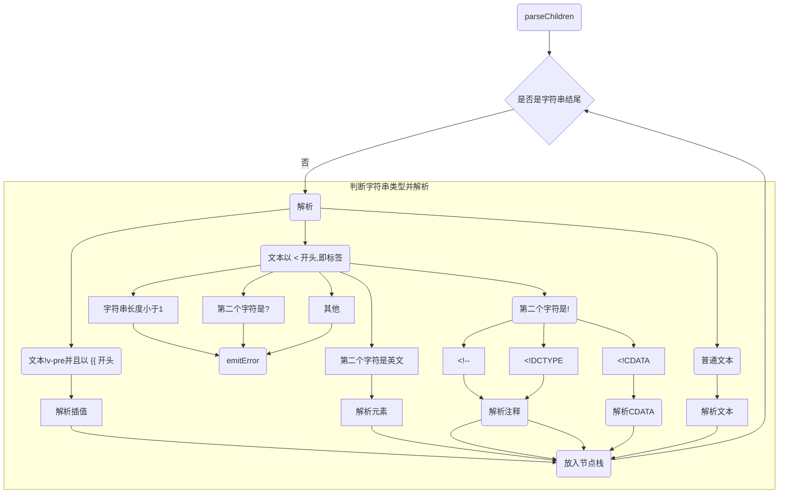
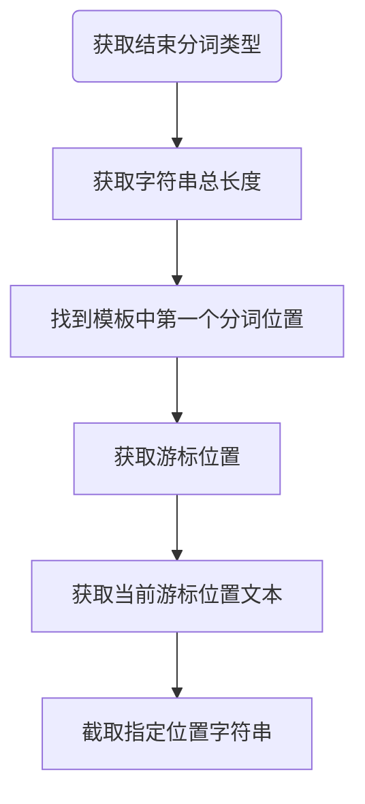
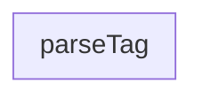

# 编译器

## 编译 - compile


## compileToFunction

方法位置: `packages/vue/src/index.ts`的`compileToFunction`

方法接收两个参数`template(模板)`与`options(编译器选项)`

1. 以模板为key查找缓存
2. 如果模板字符串以`#`开头,则作为ID选择器进行元素查找
   + 如果找到则使用元素的`innerHTML`作为模板
   + 没找到则使用空字符串作为模板
3. 调用编译方法([compile](##compile))来编译模板字符串, 获取编译得到的代码
4. 使用编译生成的代码来定义渲染方法`render`
5. 以字符串模板为key对render方法进行缓存并返回

## baseCompile

方法位置: `packages/compiler-core/src/compile.ts`

1. 调用[baseParse](##baseParse)将字符串模板转化为AST(抽象语法树)
2. 获取节点和指令转换方法
3. 转换节点[transform](##Transform - 转换节点)
4. 构建节点(`generate`)


## baseParse - 基础语法分析器

方法位置: `packages/compiler-core/src/parse.ts`

该方法将字符串模板转化为抽象语法树(AST)

1. 创建解析上下文对象

2. 获取游标位置

3. 创建根节点(`createRoot`)

   先调用`parseChildren`来解析模板, 然后获取模板位置信息


## parse - 解析


### TextModes -- 文本类型

```typescript
export const enum TextModes {
  //          | Elements | Entities | 结束标识              | 包括
  DATA, //    | ✔        | ✔        | End tags of ancestors |
  RCDATA, //  | ✘        | ✔        | End tag of the parent | <textarea>
  RAWTEXT, // | ✘        | ✘        | End tag of the parent | <style>,<script>
  CDATA,
  ATTRIBUTE_VALUE
}
```




### parseText

解析文本

```typescript
function parseText(context: ParserContext, mode: TextModes): TextNode {
  const endTokens =
    mode === TextModes.CDATA ? [']]>'] : ['<', context.options.delimiters[0]]
  // 字符串总长度
  let endIndex = context.source.length
  for (let i = 0; i < endTokens.length; i++) {
    const index = context.source.indexOf(endTokens[i], 1)
    if (index !== -1 && endIndex > index) {
      endIndex = index
    }
  }
  const start = getCursor(context)
  const content = parseTextData(context, endIndex, mode)
  return {
    type: NodeTypes.TEXT,
    content,
    loc: getSelection(context, start)
  }
}
```


## parseChildren





解析后的数据将会被放入节点栈中

遍历解析好的节点, 移除空节点(`\t`, `\r`, `\f`, `\n`)

移除空格节点

## parseText - 解析文本




`advanceBy`: 截取给定长度字符串(留下后面的字符串)


## ParseElement - 解析HTML标签元素

1. 获取父元素
2. 解析标签元素[parseTag](##ParseTag - 解析标签)
3. 如果元素是自闭合标签或者是空标签, 则直接返回第2步解析好的标签元素
4. 将解析好的标签元素对象放入**祖先栈(`ancestors`)**中
5. 调用[parseChildren](##parseChildren)来解析子元素(已解析好的元素作为父元素)
6. 将父标签元素出栈(`ancestors.pop()`)
7. 将子元素赋值给解析的标签元素
8. 设置元素位置信息`loc`
9. 返回解析好的元素




## ParseTag - 解析标签

1. 通过正则获取标签类型
2. 更新并获取游标位置, 同时更新待解析字符串
3. 检查是否是`<pre>`标签
4. 解析标签属性(`parseAttributes`)
   1. 初始化属性数组
   2. 前进游标解析字符串, 直到遇到结束标签(`>`, `/>`)
      1. 解析标签属性值[parseAttribute](##ParseAttribute - 解析HTML元素标签属性)
      2. [为`class`属性调整空格(`trim`)]( https://github.com/vuejs/vue-next/issues/4251)
      3. 将解析好的属性对象放入结果数组
      4. 移除空格前进游标
   3. 返回属性数组
5. 检查`v-pre`
6. 根据是否是自闭合标签来将游标前进`2`或`1`
7. 如果标签是`slot`,`template`或者是Vue组件, 更新标签类型值
8. 返回解析好的对象


## ParseAttribute - 解析HTML元素标签属性

1. 通过正则获取标签属性名
2. 判断是否有重名属性, 有则报错
3. 解析属性值[parseAttributeValue](##ParseAttributeValue), 如果没有值则报错
4. 如果以`v-`等vue字段开头的属性
   1. 待补充
5. 返回解析结果


## ParseAttributeValue - 解析HTML元素标签属性值

`parseAttributeValue`: 如果有引号, 则先移动游标去除引号, 之后解析文本作为标签属性值


## Transform - 转换节点

方法位置: `packages/compiler-core/src/transform.ts`

1. 创建转换上下文对象
2. 转换节点([(traversNode)](##TraverseNode - 转换节点))
3. **静态节点提升**
4. 完成元信息定义


## TraverseNode - 转换节点

1. 执行12道工序, 具体转换内容以及顺序如下

   转换操作会改变原节点数据结构, 标记`*`的方法将会在退出的时候执行

   1. `v-once`
   2. `v-if`, `v-else`, `v-else-if`
   3. `v-memo`
   4. `v-for`
   5. 指令
   6. `slot`
   7. `postTransformElement`: 结束的时候执行, 确保所有的子节点转换流程都已完成. 生成AST *
   8. 跟踪插槽作用域`trackSlotScopes`
   9. 转换文本, 将相邻的文本和表达式合并为一个表达式(如`<div>abc{{d}} {{e}}</div>`) *
   10. 移除`<script>`, `<style>`标签
   11. `inline CSS`, 将静态的行内样式转换为等价的动态对象(` style="color: red" -> :style='{ "color": "red" }'`)
   12. 内置`transition`标签

2. 根据节点类型来进行进一步处理

3. 执行第二步遗留的方法(倒序执行, 即, 先转换文本, 再构建AST)


## HoistStatic - 静态节点提升


## generate

生成方法

1. 生成方法前言([genFunctionPreamble](##genFunctionPreamble))
2. 如果使用块(Block), 则添加帮助函数
3. 如果有组件, 则调用(`genAssets`)
4. 如果有指令, 则调用(`genAssets`)
5. 最终返回生成对象, 包含了`ast`, `生成的组件代码`, `生成的前言代码`

## genFunctionPreamble

构建方法前言

```javascript
const _Vue = Vue
const { createElementVNode: _createElementVNode, createTextVNode: _createTextVNode } = _Vue
```

如果有提升的静态节点, 调用[genHoist](##genHoist)来构建静态节点定义

添加`return`

```javascript
const _Vue = Vue
const { createElementVNode: _createElementVNode, createTextVNode: _createTextVNode } = _Vue
// ...静态节点定义
return
```


## genHoists

遍历提升的静态节点, 构建属性定义

```javascript
const _Vue = Vue
const { createElementVNode: _createElementVNode, createTextVNode: _createTextVNode } = _Vue

const _hoisted_1 = { class: "todoapp" }
const _hoisted_2 = { class: "header" }
const _hoisted_3 = /*#__PURE__*/_createElementVNode("h1", null, "todos", -1 /* HOISTED */)
const _hoisted_4 = ["onUpdate:modelValue", "onKeyup"]
const _hoisted_5 = { class: "main" }
const _hoisted_6 = ["onUpdate:modelValue"]
const _hoisted_7 = /*#__PURE__*/_createElementVNode("label", { for: "toggle-all" }, "Mark all as complete", -1 /* HOISTED */)
const _hoisted_8 = { class: "todo-list" }
const _hoisted_9 = { class: "view" }
const _hoisted_10 = ["onUpdate:modelValue"]
const _hoisted_11 = ["onDblclick"]
const _hoisted_12 = ["onClick"]
const _hoisted_13 = ["onUpdate:modelValue", "onBlur", "onKeyup"]
const _hoisted_14 = { class: "footer" }
const _hoisted_15 = { class: "todo-count" }
const _hoisted_16 = /*#__PURE__*/_createTextVNode()
const _hoisted_17 = { class: "filters" }
const _hoisted_18 = ["onClick"]

```

