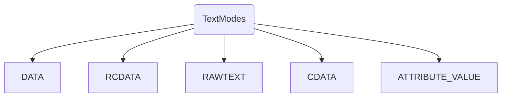
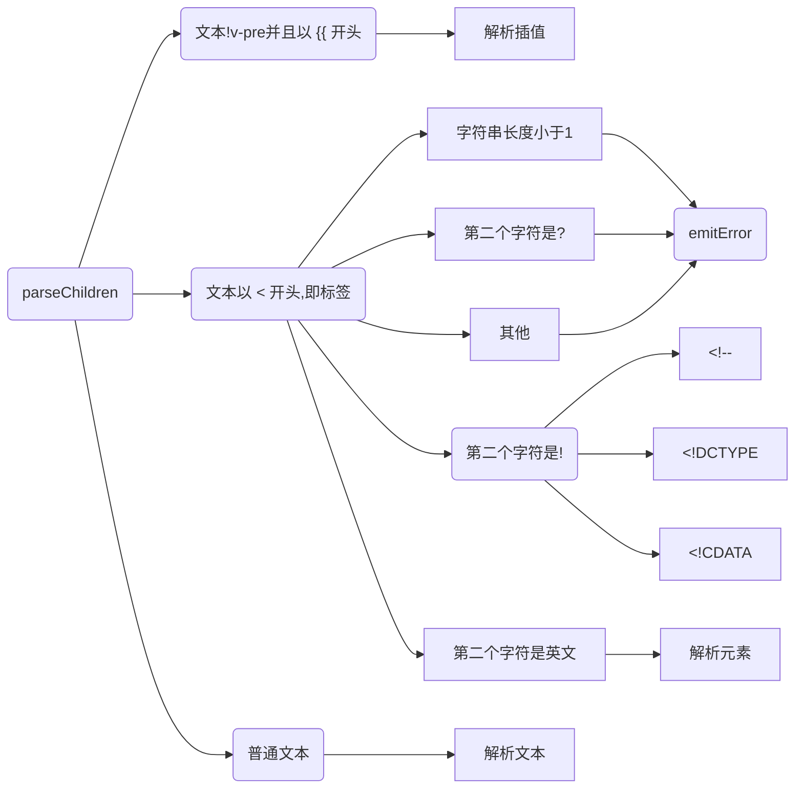

# 编译器

## 编译 - compile

### compileToFunction


### baseParse - 基础语法分析器

`packages/compiler-core/src/parse.ts`

该方法将字符串模板转化为抽象语法树(AST)


## parse - 解析


### TextModes -- 文本类型

```typescript
export const enum TextModes {
  //          | Elements | Entities | 结束标识              | 包括
  DATA, //    | ✔        | ✔        | End tags of ancestors |
  RCDATA, //  | ✘        | ✔        | End tag of the parent | <textarea>
  RAWTEXT, // | ✘        | ✘        | End tag of the parent | <style>,<script>
  CDATA,
  ATTRIBUTE_VALUE
}
```




### parseText

解析文本

```typescript
function parseText(context: ParserContext, mode: TextModes): TextNode {
  const endTokens =
    mode === TextModes.CDATA ? [']]>'] : ['<', context.options.delimiters[0]]
  // 字符串总长度
  let endIndex = context.source.length
  for (let i = 0; i < endTokens.length; i++) {
    const index = context.source.indexOf(endTokens[i], 1)
    if (index !== -1 && endIndex > index) {
      endIndex = index
    }
  }
  const start = getCursor(context)
  const content = parseTextData(context, endIndex, mode)
  return {
    type: NodeTypes.TEXT,
    content,
    loc: getSelection(context, start)
  }
}
```




