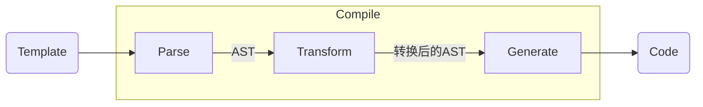

# 编译器 - compiler-core

## 编译 - compile

编译方法实际上调用`baseCompile`方法来进行模板编译, 模板编译过程主要分为3个阶段

1. [`Parse`](./Parse.md): 解析, 将模板解析为AST
2. [`Transform`](./Transform.md): 转换, 转换节点, 并提升静态节点
3. [`Generate`](./Generate.md): 生成, 将AST转换为代码




## compileToFunction

方法位置: `packages/vue/src/index.ts`的`compileToFunction`

方法接收两个参数`template(模板)`与`options(编译器选项)`

1. 以模板为key查找缓存
2. 如果模板字符串以`#`开头,则作为ID选择器进行元素查找
   + 如果找到则使用元素的`innerHTML`作为模板
   + 没找到则使用空字符串作为模板
3. 调用编译方法([compile](##compile))来编译模板字符串, 获取编译得到的代码
4. 使用编译生成的代码来定义渲染方法`render`
5. 以字符串模板为key对render方法进行缓存并返回

## baseCompile

方法位置: `packages/compiler-core/src/compile.ts`

1. 调用[baseParse](##baseParse)将字符串模板转化为AST(抽象语法树)
2. 获取节点和指令转换方法
3. 转换节点[transform](##Transform - 转换节点)
4. 构建节点(`generate`)


## baseParse - 基础语法分析器

方法位置: `packages/compiler-core/src/parse.ts`

该方法将字符串模板转化为抽象语法树(AST)

1. 创建解析上下文对象

2. 获取游标位置

3. 创建根节点(`createRoot`)

   先调用`parseChildren`来解析模板, 然后获取模板位置信息


## 

## Transform - 转换节点

方法位置: `packages/compiler-core/src/transform.ts`

1. 创建转换上下文对象
2. 转换节点([(traversNode)](##TraverseNode - 转换节点))
3. **静态节点提升**
4. 完成元信息定义


## TraverseNode - 转换节点

1. 执行12道工序, 具体转换内容以及顺序如下

   转换操作会改变原节点数据结构, 标记`*`的方法将会在退出的时候执行

   1. `v-once`
   2. `v-if`, `v-else`, `v-else-if`
   3. `v-memo`
   4. `v-for`
   5. 指令
   6. `slot`
   7. `postTransformElement`: 结束的时候执行, 确保所有的子节点转换流程都已完成. 生成AST *
   8. 跟踪插槽作用域`trackSlotScopes`
   9. 转换文本, 将相邻的文本和表达式合并为一个表达式(如`<div>abc{{d}} {{e}}</div>`) *
   10. 移除`<script>`, `<style>`标签
   11. `inline CSS`, 将静态的行内样式转换为等价的动态对象(` style="color: red" -> :style='{ "color": "red" }'`)
   12. 内置`transition`标签

2. 根据节点类型来进行进一步处理

3. 执行第二步遗留的方法(倒序执行, 即, 先转换文本, 再构建AST)


## HoistStatic - 静态节点提升


## generate

生成方法

1. 生成方法前言([genFunctionPreamble](##genFunctionPreamble))
2. 如果使用块(Block), 则添加帮助函数
3. 如果有组件, 则调用(`genAssets`)
4. 如果有指令, 则调用(`genAssets`)
5. 最终返回生成对象, 包含了`ast`, `生成的组件代码`, `生成的前言代码`

## genFunctionPreamble

构建方法前言

```javascript
const _Vue = Vue
const { createElementVNode: _createElementVNode, createTextVNode: _createTextVNode } = _Vue
```

如果有提升的静态节点, 调用[genHoist](##genHoist)来构建静态节点定义

添加`return`

```javascript
const _Vue = Vue
const { createElementVNode: _createElementVNode, createTextVNode: _createTextVNode } = _Vue
// ...静态节点定义
return
```


## genHoists

遍历提升的静态节点, 构建属性定义

```javascript
const _Vue = Vue
const { createElementVNode: _createElementVNode, createTextVNode: _createTextVNode } = _Vue

const _hoisted_1 = { class: "todoapp" }
const _hoisted_2 = { class: "header" }
const _hoisted_3 = /*#__PURE__*/_createElementVNode("h1", null, "todos", -1 /* HOISTED */)
const _hoisted_4 = ["onUpdate:modelValue", "onKeyup"]
const _hoisted_5 = { class: "main" }
const _hoisted_6 = ["onUpdate:modelValue"]
const _hoisted_7 = /*#__PURE__*/_createElementVNode("label", { for: "toggle-all" }, "Mark all as complete", -1 /* HOISTED */)
const _hoisted_8 = { class: "todo-list" }
const _hoisted_9 = { class: "view" }
const _hoisted_10 = ["onUpdate:modelValue"]
const _hoisted_11 = ["onDblclick"]
const _hoisted_12 = ["onClick"]
const _hoisted_13 = ["onUpdate:modelValue", "onBlur", "onKeyup"]
const _hoisted_14 = { class: "footer" }
const _hoisted_15 = { class: "todo-count" }
const _hoisted_16 = /*#__PURE__*/_createTextVNode()
const _hoisted_17 = { class: "filters" }
const _hoisted_18 = ["onClick"]

```

