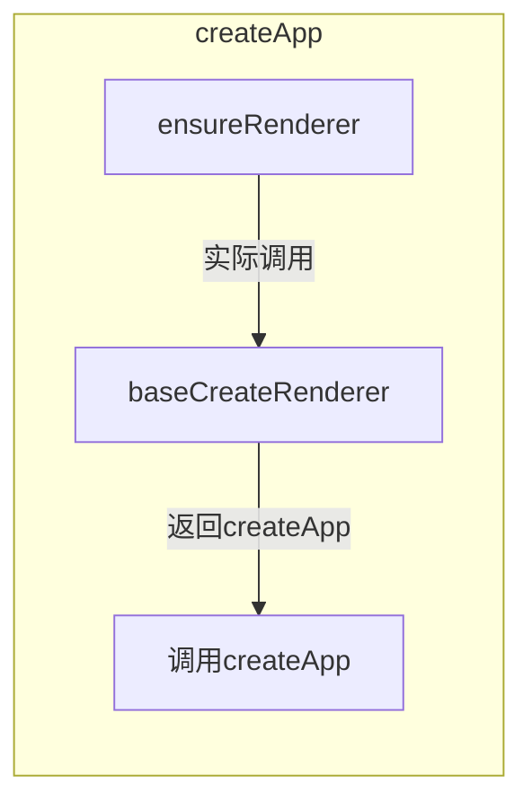
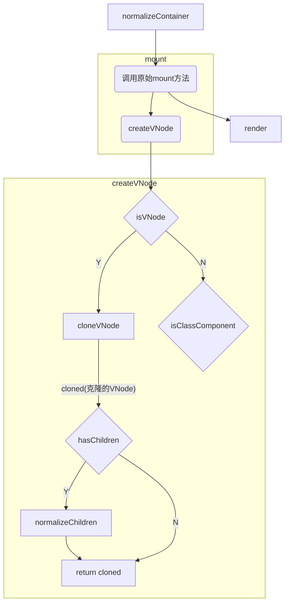
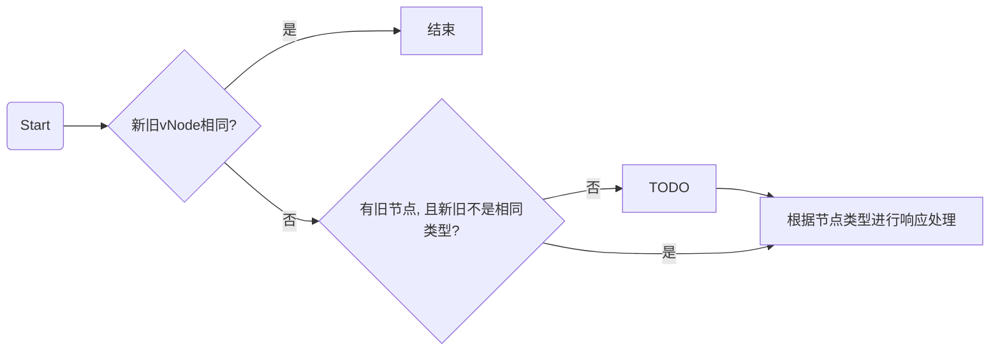

# 待整理

## APP实例

首先,我们先了解一下Vue实例(App对象)所包含的属性以及方法.

控制台输出的`createApp()`创建的Vue实例对象


## CreateApp

`CreateApp`是Vue3的实例创建方法, 方法定义在`runtime-dom/src/index.ts`

方法主要调用流程如下:



1. 调用 `ensureRenderer` 方法来创建渲染器(单例)

   创建渲染器.`runtime-core/src/renderer.ts` 的 `baseCreateRenderer` 方法

   `baseCreateRenderer`方法主要定义了**补丁(patch)方法**以及**一些vNode操作方法**

   <details>
     <summary>定义方法一览</summary>
     <ul>
       <li>补丁方法
         <ul>
           <li>patch</li>
           <li>patchChildren</li>
       		<li>patchBlockChildren</li>
         </ul>
       </li>
       <li>vNode操作
         <ul>
           <li>unmount</li>
           <li>move</li>
           <li>remove</li>
           <li>mountComponent</li>
           <li>mountChildren</li>
         </ul>
       </li>
       <li>getNextHostNode</li>
       <li>options(包含一些dom操作方法的对象)</li>
       <li><b>render(渲染方法, 会传给<code>createAppApi</code>)</b></li>
     </ul>
   </details>

2. 调用`createAppAPI中的createApp`方法来创建Vue实例对象

   实则调用`runtime-core/src/apiCreateApp.ts`中的`createAppAPI`的返回值`createApp`方法来创建实例对象

   该方法主要内容是

   + 初始化Vue实例对象(定义对象以及一些操作方法)
   + 初始化安装的插件
   + 初始化挂载标识(`isMounted=false`)

   

3. 重写第二步创建好的Vue实例对象的`mount`方法

   1. 调用`normalizeContainer`方法来标准化容器
   2. 如果组件对象没有定义`render`函数和`template`模板，则取容器的`innerHTML` 作为组件模板内容
   3. 清空容器内容(`innerHTML = ''`)
   4. 调用原始`mount`方法作为方法返回值
   5. 移除容器`v-cloak`属性
   6. 为容器设置`data-v-app`属性, 表明元素是一个Vue实例容器

4. Vue实例创建完成, 等待调用`mount`方法进行挂载

## Mount(原始版本)

调用完`createApp`创建Vue实例后最终需要挂载到指定元素上, 调用`mount`方法并传入目标容器来进行挂载操作.




1. 创建VNode对象
2. 将app对象存储在vNode对象上
3. 进行渲染(调用`render`)
4. 设置挂载标识(`isMounted`)为`true`
5. 缓存根节点容器(`rootContainer`)
6. 通过`__vue_app__`属性为`devtools`暴露vue实例


## Render

首先, 我们来看一下render方法的定义

```typescript
const render = (vnode, container, isSVG) => {
  // 如果vnode为空， 则表明元素被清空
  if (vnode == null) {
    // 如果容器之前挂载过vNode，则卸载之前挂载的vNode
    if (container._vnode) {
      unmount(container._vnode, null, null, true);
    }
  }
  else {
    // 如果有vNode， 即容器内元素变化，打补丁(patch 方法由ensureRenderer定义)
    patch(container._vnode || null, vnode, container, null, null, null, isSVG);
  }
  // 刷新后置任务
  flushPostFlushCbs();
  // 更新vNode绑定
  container._vnode = vnode;
};
```

`render`方法接收三个参数`(vnode, container, isSVG)`

+ vNode: 待渲染的vNode
+ container: 渲染容器
+ isSVG: 是否是SVG

1. 判断是否有需要渲染的vNode, 

   + 如果没有, 则卸载之前容器挂载过的vNode(如果存在的话)

   + 如果有, 则调用补丁方法来为容器更新节点

2. 冲洗后置任务队列(`flushPostFlushCbs`)
3. 为容器更新`_vnode`属性

## Patch

补丁方法




1. 判断是否是相同节点, 如果相同则直接退出
2. 如果有容器有旧节点, 并且新节点与旧节点类型不同, 则将**锚点**设置为旧节点的下一个节点并卸载旧节点
3. 判断新节点类型, 根据不同的节点类型来进行不同处理
   + Text: 
   + Comment:
   + Static:
   + Fragment:
   + Others:
     + Element:
     + Component
       + 继承slotScopeIds
       + 如果原容器没有节点
         + 如果不是keepAlive, 则挂载节点(`mountComponent`)
         + 如果是keepAlive, 则`activate`
       + 原容器有节点, 则更新组件(`updateComponent`)
     + Teleport:
     + Suspense:

4. 如果有`ref`则调用`setRef`来设置ref

## MountComponent

挂载组件方法, 方法大致流程以及操作如下

1. 创建组件实例
2. 如果是keepAlive组件则更新renderer
3. 设置组件(`setupComponent`)
   1. 设置`props`, `attrs`
   2. 设置`slots`
   3. **如果是有状态组件,且有组件有`setup`方法, 则执行`setup`**
4. 设置渲染器影响(`setupRenderEffect`)
   1. 定义组件更新方法
   2. 为渲染过程创建响应式影响对象

## 响应式

`createReactiveObject`

`packages/reactivity/src/reactive.ts`

只有以下类型对象可以进行转化为响应式对象(Proxy)

+ Object
+ Array
+ Map
+ Set
+ WeakMap
+ WeakSet


以下类型对象无法进行转化

+ 有真值的`__v_skip`属性
+ 有真值的`__v_raw`属性
+ 有真值的`__v_isReactive`属性
+ 有真值的`__v_isReadonly`属性


1. 如果有对应缓存则直接返回缓存proxy对象

2. 根据对象是`集合(collection)`还是`普通对象(common)`来设置不同的代理处理方法

3. 以原始对象为key,代理对象为value放入代理表(`proxyMap`)进行缓存


## SetupComponent

方法定位: `packages/runtime-core/src/component.ts`

`initProps`: 初始化组件的`props`和`attrs`

`initSlots`: 初始化组件的插槽

如果是有状态的组件, 则调用`setupStatefulComponent`


### setupStatefulComponent

方法定位: `packages/runtime-core/src/component.ts`

配置有状态组件

1. 创建渲染函数代理属性访问缓存
2. 创建一个不被观测的组件实例上下文代理对象
3. 如果组件有配置`setup`, 则调用实例`setup`方法
4. 没有配置`setup`就结束组件配置(调用`finishComponentSetup`来进行模板编译)


