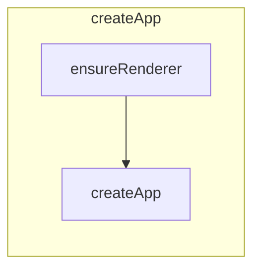
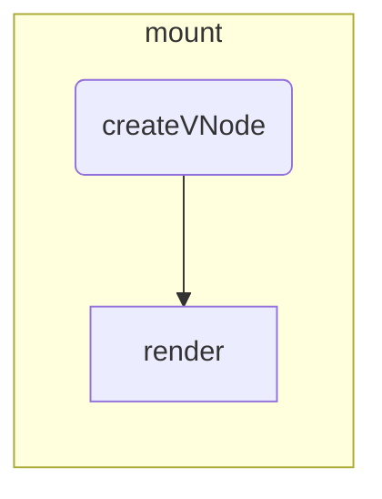
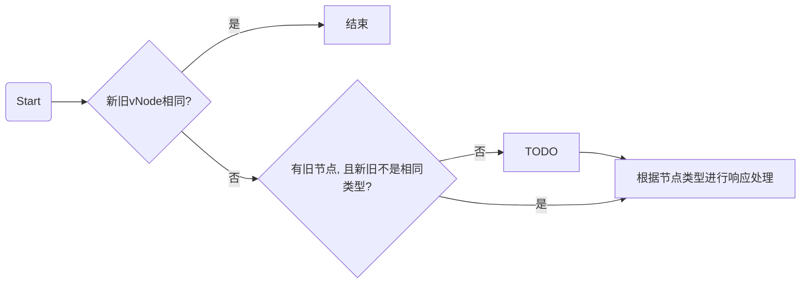

# 待整理

## APP实例

首先,我们先了解一下Vue实例(App对象)所包含的属性以及方法.

控制台输出的`createApp()`创建的Vue实例对象

## CreateApp

`CreateApp`是Vue3的实例创建方法, 方法定义在`runtime-dom/src/index.ts`

方法主要流程如下:

1. 调用 `ensureRenderer` 方法来创建渲染器(单例)

   创建渲染器.`runtime-core/src/renderer.ts` 的`baseCreateRenderer` 方法

   `baseCreateRenderer`方法主要定义了一些**补丁方法**以及**vNode操作方法**

   

     
定义方法一览

     <ul>
       <li>补丁方法
         <ul>
           <li>patch</li>
           <li>patchChildren</li>
       		<li>patchBlockChildren</li>
         </ul>
       </li>
       <li>vNode操作
         <ul>
           <li>unmount</li>
           <li>move</li>
           <li>remove</li>
           <li>mountComponent</li>
           <li>mountChildren</li>
         </ul>
       </li>
       <li>getNextHostNode</li>
       <li>options(包含一些dom操作方法的对象)</li>
       <li><b>render(渲染方法, 会传给<code>createAppApi</code>)</b></li>
     </ul>
   

2. 调用`createAppAPI中的createApp`方法来创建Vue实例对象

   实则调用`runtime-core/src/apiCreateApp.ts`中的`createAppAPI`的返回值`createApp`方法来创建实例对象

   该方法主要内容是

   + 初始化Vue实例对象(定义对象以及一些操作方法)
   + 初始化安装的插件
   + 初始化挂载标识(`isMounted=false`)

   

3. 重写`mount`方法

   1. 调用`normalizeContainer`方法来标准化容器
   2. 如果组件对象没有定义`render`函数和`template`模板，则取容器的`innerHTML` 作为组件模板内容
   3. 清空容器内容(`innerHTML = ''`)
   4. 调用原始`mount`方法作为方法返回值

## Mount

调用完`createApp`创建Vue实例后最终需要挂载到指定元素上, 调用`mount`方法并传入目标容器来进行挂载操作.

## Patch

补丁方法

## 响应式

`createReactiveObject`

`packages/reactivity/src/reactive.ts`

只有以下类型对象可以进行转化为响应式对象(Proxy)

+ Object
+ Array
+ Map
+ Set
+ WeakMap
+ WeakSet

以下类型对象无法进行转化

+ 有真值的`__v_skip`属性
+ 有真值的`__v_raw`属性
+ 有真值的`__v_isReactive`属性
+ 有真值的`__v_isReadonly`属性

1. 如果有对应缓存则直接返回缓存proxy对象

2. 根据对象是`集合(collection)`还是`普通对象(common)`来设置不同的代理处理方法

3. 以原始对象为key,代理对象为value放入代理表(`proxyMap`)进行缓存

## SetupComponent

方法定位: `packages/runtime-core/src/component.ts`

`initProps`: 初始化组件的`props`和`attrs`

`initSlots`: 初始化组件的插槽

如果是有状态的组件, 则调用`setupStatefulComponent`

### setupStatefulComponent

方法定位: `packages/runtime-core/src/component.ts`

配置有状态组件

1. 创建渲染函数代理属性访问缓存
2. 创建一个不被观测的组件实例上下文代理对象
3. 如果组件有配置`setup`, 则调用实例`setup`方法
4. 没有配置`setup`就结束组件配置(调用`finishComponentSetup`来进行模板编译)

