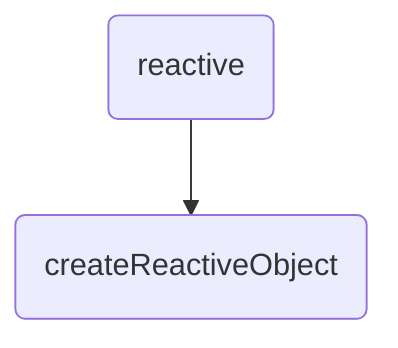

# Reactivity


因为Vue3使用monorepo项目结构, 响应式相关的代码也都独立在`reactivity`包中.

我们可以直接debug源码来逐步搞清响应式的原理.

可以通过`node scripts/build.js --_ reactivity --s`来编译特定的包


先来写个简单的demo来debug(或者使用源码写好的jest用例来测试)

```javascript
const {
  reactive,
  effect
} = require('../dist/reactivity.cjs')

const a = reactive({
  name: 'howe',
  age: 16
})

const eff = effect(() => {
  console.log(a.age)
})

a.age = 10

```


Track: 在一个值被读取的时候进行追踪(通过proxy 的 get)

trigger: 在某个值改变的时候检测副作用依赖并执行(通过proxy 的 set)


方法执行顺序




