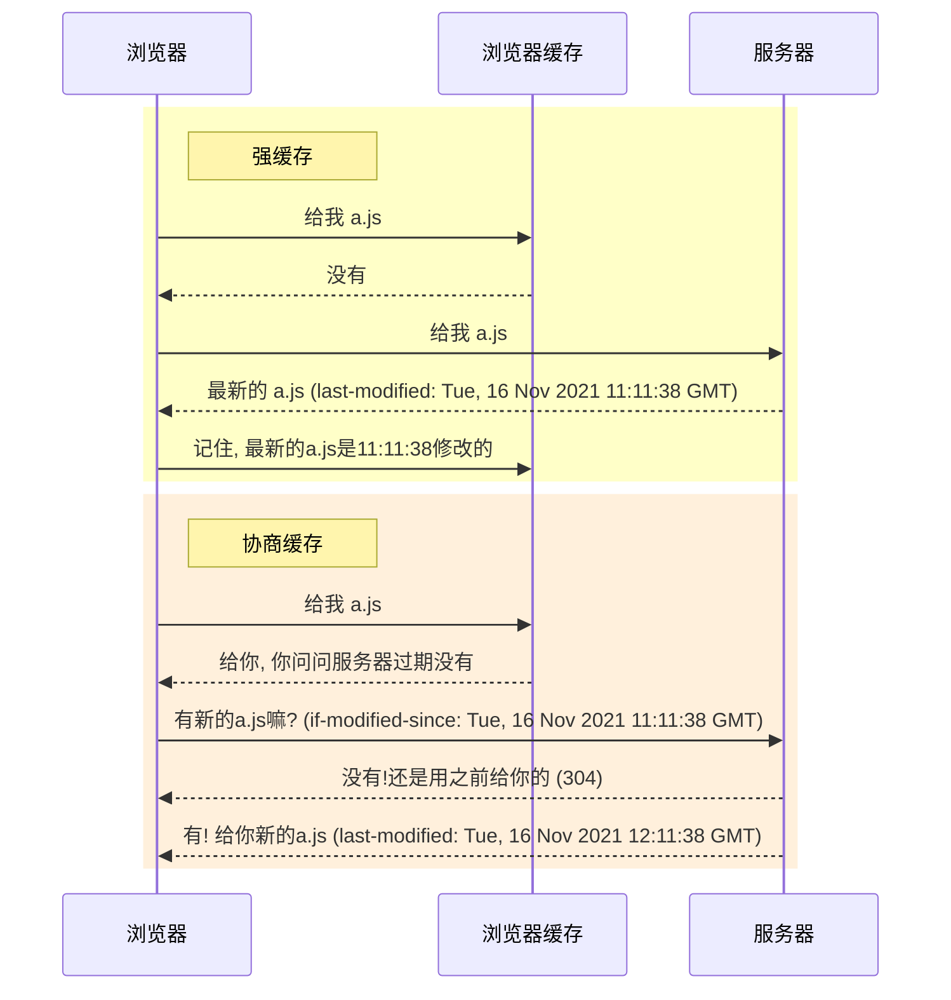

# 浏览器缓存

在我们打开浏览器访问网页的时候, 如果在浏览过程中**刷新网页**或者**打开之前访问过的网页**,那么我们会感觉网页载入的速度会明显快于首次

导致该现象的原因就是因为浏览器缓存机制


让我们按照下面步骤进行操作来查看浏览器的请求

1. 打开浏览器**开发人员工具**
2. 然后点击**网络**标签
3. 刷新网页

这时候我们可能会看到一些请求的大小会如下图显示


红框标出的 `内存缓存` 和 `磁盘缓存`(英文分别为`from memory`, `from disk`)即为浏览器缓存


## 总结

+ 缓存为服务端进行设置(因为缓存是作用于请求结果, 而请求结果由服务器返回)
+ 缓存分为`强缓存(200)`和`协商缓存(304)`

+ `etag`&`if-none-match`优先级 > `last-modified`&`if-modified-since` 
+ `cache-control`优先级 > `expired`

+ `etag`默认计算方式为: 文件`last-modified`的十六进制 + `content-length`的十六进制拼接而成

+ `etag`改变不能代表文件也变化, 需要根据etag的算法来判断

## 问题

1. 什么是缓存, 缓存都有哪些种类?
2. 缓存有什么好处以及副作用?
3. 如何设置缓存?
4. 如果不显式的设置缓存, 什么样的资源将会被缓存?

## 缓存的好处以及副作用

### 好处

在我们请求一些存在缓存的资源的时候, 浏览器将不会再向服务器发起请求, **加快资源加载速度**并**减少服务器请求负担**

### 副作用

对于开发人员来说, 在我们打包发布之后如果资源名称没有改变的话, 浏览器会使用之前缓存过的资源

这会导致部分用户(之前访问过用户)无法及时获取最新的资源, 导致文件版本不一致从而引发程序错误


## 缓存位置

根据文章开始的请求截图, 存放缓存的位置有以下几种:

+ `Service Worker`(图中没有体现)
+ `Memory Cache`(内存缓存)
+ `Disk Cache`(磁盘缓存)

浏览器在请求资源的时候会按照上面的位置顺序依次查找, 看看是否有对应的缓存, 如果都没有的话才会向服务器发起请求

那么, **为什么有些资源会在`内存缓存`而有些资源会在`磁盘缓存`呢?**

首先, 当我们打开一个网页的时候, 浏览器会根据自己的策略以及当前的内存使用情况来决定哪些请求的资源将会被缓存

如果该网页是之前访问过的, 并且其请求缓存都没有过期, 则再次打开该网页将会**从磁盘中加载缓存**.

如果刷新当前网页, 则刷新前请求的资源将会**从内存中进行加载**(<u>因为从内存中直接读取比从磁盘中读取要快很多</u>),

当关闭当前Tab页的时, 其页面内存缓存将被清空, 再次访问就会变为从磁盘中加载

其次, 较大的文件以及当前系统内存使用率较高的情况下资源**优先**会被放到`磁盘缓存`中, 其次才会放入`内存缓存`


## 缓存类型

+ 缓存指令是单向的, 在请求中设置的指令不一定被包含在响应中.

+ 指令不区分大小写, 但是最好以小写进行配置

+ 缓存针对的请求都是GET请求的响应结果

+ 在没有设置`cache-control: max-age`或者`expires`的时候, 浏览器会使用`启发式缓存`的模式对资源进行缓存,

  浏览器会推测资源的新鲜度生命周期.

### 强(制)缓存: status: 200

过程: 客户端发起请求, 如果有该请求对应缓存, 直接返回缓存, 否则请求服务器, 然后将内容进行缓存

对应**响应头(response header)**字段为

+ `expires(HTTP1.0)`

  标识资源过期时间(GMT), 再次请求资源的时候会使用**本地时间**与该时间进行比较,如果未过期(本地时间<=过期时间)则直接使用该缓存.

  > 因为使用的是本地时间进行比较, 所以可能由于本地时间不准确或者手动调整而导致缓存失效

+ `cache-control(HTTP1.1)`

  优先级高于`expires`, 标识缓存策略以及缓存时间

  可配置值如下, 可以组合配置

  **缓存性**

  + `public`: 客户端(浏览器)和服务器都可以缓存
  + `private`: 只有客户端可以缓存
  + `no-cache`: 忽略本地缓存, 强制向服务器发起请求进行资源验证(走协商缓存进行资源比对来决定是否使用本地缓存)
  + `no-store`: 不使用缓存

  **过期时间**

  + `max-age=X`: 最大缓存有效期为X秒
  + `max-stale[=X]`: 最大过期时间(即客户端可以接收一个过期了的资源, 但不能超过**可选**的X秒)
  + `min-fresh=X`: 在X秒内最新的资源, 超出即为过期, 重新请求.

  **其他**

  + `must-revalidate`: 必须重新验证资源
  + `only-if-cached`: 只使用客户端缓存, 不向服务器发送请求进行验证

  > `no-cache` 等同于 `max-age=0, must-revalidate`


### 协商缓存: status: 304

当本地缓存失效的时候, 就需要向服务器发起请求来进行资源比对, 由服务器来决定内容是否真实失效, 如果失效则返回最新文件, 未失效返回状态码304, 这个过程就叫做协商缓存

对应响应头字段为

+ `last-modified` 和 `if-modified-since`组合

  `last-modified`根据文件的`mtime(modify time)`生成



> 缺点: 
>
> 1. 更新时间判断的颗粒度只能到秒级, 无法支持秒级以下的资源判断(不知道什么场景会用到秒级以下🤷‍♀️)
> 2. 如果文件是在服务器上动态生成的, 那么last-modified的时间会一直更新, 则起不到缓存作用


+ `etag` 和 `if-none-match`组合

  `etag`相当于给定资源的指纹, 可以快速比较出资源是否发生了变化.

  形式为: `ETag: W/"<etag_value>"`或者`ETag: "<etag_value>"`

  使用方式上与`last-modified`和`if-modified-since`一致(将`last-modified`替换为`etag`, `if-modified-since`替换为`if-none-match`)

  

  `etag_value`通常由`last-modified`与`content-length`组合计算生成

  比如`Nginx`下`etag`计算方式: <u>`last-modified`的十六进制 + `content-length`的十六进制拼接而成</u>

  <u>etag的计算方式是可以自定义的, 所以`etag值变化就代表服务器文件内容一定改变`这句话的真伪需要根据etag的算法来判断.</u>


## 设置缓存

客户端设置的缓存规则

需要在**服务器端**进行缓存规则配置.下面以nginx为例

```nginx
server {
    listen       80;
    server_name  xxx.xxx.com;
    root         /app/xxx/html/;
    location ~ .*\.(?:jpg|jpeg|gif|png|ico|cur|gz|svg|svgz|mp4|ogg|ogv|webm)$
    {
        expires      7d;
    }

    location ~ .*\.(?:js|css)$
    {
        expires      7d;
    }

    location ~ .*\.(?:htm|html)$    #不缓存html
    {
        add_header Cache-Control "private, no-store, no-cache, must-revalidate, proxy-revalidate";
    }
}
```


## 关联知识点

+ [Service Worker](./Service-Worker.md)
+ [HTTP Headers](./Network/HTTP-Headers.md)
+ [HTTP各版本特性以及区别](./Network/HTTP.md)


## 参考链接

+ [Prevent unnecessary network requests with the HTTP Cache (web.dev)](https://web.dev/http-cache/)

+ [mnot’s blog: The State of Browser Caching, Revisited](https://www.mnot.net/blog/2017/03/16/browser-caching#heuristic-freshness)
+ [Cache-Control - HTTP | MDN (mozilla.org)](https://developer.mozilla.org/zh-CN/docs/Web/HTTP/Headers/Cache-Control)

+ [前端浏览器缓存知识梳理 - 掘金 (juejin.cn)](https://juejin.cn/post/6947936223126093861)

+ [深入理解浏览器的缓存机制 - 简书 (jianshu.com)](https://www.jianshu.com/p/54cc04190252)
