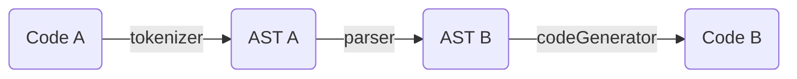

# Babel

Babel可以说是大家比较属性的工具了, 但是我们经常只是走马观花的了解一下这东西是个啥, 只知道它帮我们转换了代码(至少知道这是个编译器)

官方说明为: **Babel 是一个 JavaScript 编译器**

既然知道了Babel是一个编译器, 那么就让我们从编译器开始来了解Babel

## 编译器是什么

编译器可以简单理解为`翻译`

比如我们开发者开发的代码是`ES6`, 但是代码的目标运行环境是`ES5`


👩‍💻 程序员: `const a = flag ?? 'a'`

💻 ES5环境: WTF? 你说啥??? 我听不懂啊!!! ❌


这时候就需要一个翻译来将我们的`ES6+`的语言翻译成环境能够听懂的, 这个翻译就称为`编译器`.


👩‍💻 程序员: 小翻译, 你告诉环境 `const a = flag ?? 'a'` 

🗣 编译器: `var _flag; const a = (_flag = flag) !== null && _flag !== void 0 ? _flag : 'a';`

💻 ES5环境: 👌 了解!


> 我们也可以通过[jamiebuilds/the-super-tiny-compiler](https://github.com/jamiebuilds/the-super-tiny-compiler)这个项目来了解一下到底什么是编译器.
>
> 英文不好的同学可以参考[starkwang/the-super-tiny-compiler-cn](https://github.com/starkwang/the-super-tiny-compiler-cn/blob/master/super-tiny-compiler-chinese.js)


## 编译器是如何工作的

我们知道了编译器是什么之后, 那么, 它们是如何'翻译'我们代码的呢?

首先, 一个翻译的基本技能应该就是能听说读写双方的语言.

所以, 编译器一定要能听懂(`解析`)我们所想要表达的内容, 然后在脑中翻译(`转换`)成对方能理解的语言, 最后传达(`生成`)给对方




### 解析 - tokenizer

解析来说一般会分为两个阶段

+ 词法分析

​	将一句话拆分成一个个单词(`Token`, 标点符号也算), 并标明每个单词的类型

+ 语法分析

​	接收词法分析的结果, 分析每个单词(`Token`)间的关系, 得出语义(也就是`AST`, 抽象语法树)


```javascript
// 词法分析器, 代码来自the-super-tiny-compiler.js
function tokenizer(input) {
  var current = 0;
  var tokens = [];
  while (current < input.length) {
    var char = input[current];
    if (char === '(') {
      tokens.push({
        type: 'paren',
        value: '('
      });
      current++;
      continue;
    }
    if (char === ')') {
      tokens.push({
        type: 'paren',
        value: ')'
      });
      current++;
      continue;
    }
    var WHITESPACE = /\s/;
    if (WHITESPACE.test(char)) {
      current++;
      continue;
    }
    var NUMBERS = /[0-9]/;
    if (NUMBERS.test(char)) {
      var value = '';
      while (NUMBERS.test(char)) {
        value += char;
        char = input[++current];
      }
      tokens.push({
        type: 'number',
        value: value
      });
      continue;
    }
    var LETTERS = /[a-z]/i;
    if (LETTERS.test(char)) {
      var value = '';
      while (LETTERS.test(char)) {
        value += char;
        char = input[++current];
      }
      tokens.push({
        type: 'name',
        value: value
      });
      continue;
    }
    throw new TypeError('I dont know what this character is: ' + char);
  }
  return tokens;
}
```


```javascript
// 语法分析器: 接收上一步的Token数组, 将它们转换为AST对象
function parser(tokens) {
  var current = 0;
  function walk() {
    var token = tokens[current];
    if (token.type === 'number') {
      current++;
      return {
        type: 'NumberLiteral',
        value: token.value
      };
    }
    if (token.type === 'paren' && token.value === '(') {
      token = tokens[++current];
      var node = {
        type: 'CallExpression',
        name: token.value,
        params: []
      };
      token = tokens[++current];
      while (
        (token.type !== 'paren') ||
        (token.type === 'paren' && token.value !== ')')
      ) {
        node.params.push(walk());
        token = tokens[current];
      }
      current++;
      return node;
    }
    throw new TypeError(token.type);
  }
  var ast = {
    type: 'Program',
    body: []
  };
  while (current < tokens.length) {
    ast.body.push(walk());
  }
  return ast;
}
```


### 转换 - parser

知道了原代码的意思和结构后, 就要将每个单词及结构转换成对方能听懂的形式. 

*废话: 两种语言差异性与转换的工作量基本成正比*

```javascript
function traverser(ast, visitor) {
  function traverseArray(array, parent) {
    array.forEach(child => {
      traverseNode(child, parent);
    });
  }
  function traverseNode(node, parent) {
    let methods = visitor[node.type];
    if (methods && methods.enter) {
      methods.enter(node, parent);
    }
    switch (node.type) {
      case 'Program':
        traverseArray(node.body, node);
        break;
      case 'CallExpression':
        traverseArray(node.params, node);
        break;
      case 'NumberLiteral':
      case 'StringLiteral':
        break;
      default:
        throw new TypeError(node.type);
    }
    if (methods && methods.exit) {
      methods.exit(node, parent);
    }
  }
  traverseNode(ast, null);
}
```


```javascript
function transformer(ast) {
  let newAst = {
    type: 'Program',
    body: [],
  };
  ast._context = newAst.body;
  traverser(ast, {
    NumberLiteral: {
      enter(node, parent) {
        parent._context.push({
          type: 'NumberLiteral',
          value: node.value,
        });
      },
    },
    StringLiteral: {
      enter(node, parent) {
        parent._context.push({
          type: 'StringLiteral',
          value: node.value,
        });
      },
    },
    CallExpression: {
      enter(node, parent) {
        let expression = {
          type: 'CallExpression',
          callee: {
            type: 'Identifier',
            name: node.name,
          },
          arguments: [],
        };
        node._context = expression.arguments;
        if (parent.type !== 'CallExpression') {
          expression = {
            type: 'ExpressionStatement',
            expression: expression,
          };
        }
        parent._context.push(expression);
      },
    }
  });
  return newAst;
}
```


### 生成 - code generator

根据`转换`得到的新的`AST`来生成新的代码


```javascript
function codeGenerator(node) {
  switch (node.type) {
    case 'Program':
      return node.body.map(codeGenerator)
        .join('\n');
    case 'ExpressionStatement':
      return (
        codeGenerator(node.expression) +
        ';'
      );
    case 'CallExpression':
      return (
        codeGenerator(node.callee) +
        '(' +
        node.arguments.map(codeGenerator)
          .join(', ') +
        ')'
      );
    case 'Identifier':
      return node.name;
    case 'NumberLiteral':
      return node.value;
    case 'StringLiteral':
      return '"' + node.value + '"';
    default:
      throw new TypeError(node.type);
  }
}
```


### 整合 - compiler

最后写一个compiler方法将上面方法定义整合, 就完成了一个极简的编译器

```javascript
function compiler(input) {
  let tokens = tokenizer(input);
  let ast    = parser(tokens);
  let newAst = transformer(ast);
  let output = codeGenerator(newAst);
  return output;
}
```

<iframe height="300" style="width: 100%;" scrolling="no" title="Untitled" src="https://codepen.io/lihowe/embed/preview/wvraMMO?default-tab=js%2Cresult" frameborder="no" loading="lazy" allowtransparency="true" allowfullscreen="true">
  See the Pen <a href="https://codepen.io/lihowe/pen/wvraMMO">
  Untitled</a> by Howe (<a href="https://codepen.io/lihowe">@lihowe</a>)
  on <a href="https://codepen.io">CodePen</a>.
</iframe>


## Babel可以做什么

+ 语法转换
+ 为目标环境添加缺失特性(通过引用第三方polyfill, 如`core-js`)
+ 源码转换(codemods)
+ Babel通过语法转换器来支持最新版本的JavaScript语法, 使你的代码可以在并不支持JS新特性的环境中运行.
+ 支持语法拓展, 支持`JSX` 以及` TypeScript`等语言
+ 支持插件化, 可以自己开发插件
+ 支持`Source map`, 可以让我们调试编译后的代码


## 使用


### 配置 - options

在项目中配置`babel.config.json`(后缀名也可是`.js`, `.cjs`, `.mjs`)

详细配置项可参考[Options · Babel 中文网 (babeljs.cn)](https://www.babeljs.cn/docs/options)


### 插件 - plugins

插件用于转译代码, 会在`Preset`配置之前执行

插件的执行顺序与其定义顺序相同


使用插件:

```javascript
{
  "plugins": [
    "pluginA",
    ["pluginA"],
    ["pluginA", {}]
  ]
}
```

如果想自己开发插件请参考: [babel-handbook](https://github.com/thejameskyle/babel-handbook)


### 预设 - presets

预设是指 一组被预先设置好的`Babel插件`及`Babel Options`

Babel 官方为一些常用环境提供了预设

+ `@babel/preset-env`: 相当常见的预设, 用于编译ES6+语法
+ `@babel/preset-typescript`: 由名字就可以看出, 为了编译`TypeScript`语法
+ `@babel/preset-react`: 为了编译`React`语法
+ `@babel/preset-flow`: 为了`Flow`语法

除了这些官方提供的预设外, 开源社区也有很多开发者自己开发的优秀的开源预设


使用预设:

```javascript
module.exports = () => ({
  presets: [
    "presetA", 										// 纯字符串
    ["presetA"],  								// 数组包裹的字符串
    ["presetA", {}]  							// 数组第二个参数为传给预设的参数
  ]
})
```

如果设置了多个预设, 预设的执行顺序为倒序执行(最后的最先执行), 比如

`presets: [a, b, c]` 那么执行顺序为 `c -> b -> a`

## 相关链接

+ [Core-JS](./core-js.md)

+ [jamiebuilds/the-super-tiny-compiler](https://github.com/jamiebuilds/the-super-tiny-compiler)

+ [jamiebuilds/babel-handbook (github.com)](https://github.com/jamiebuilds/babel-handbook/blob/master/translations/zh-Hans/user-handbook.md
