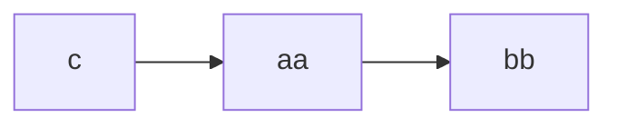
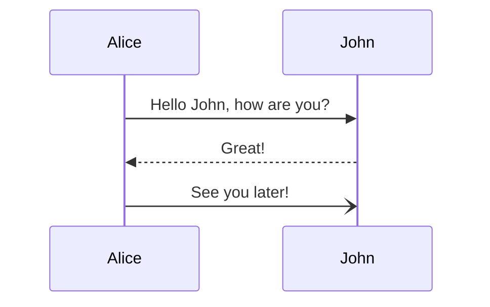
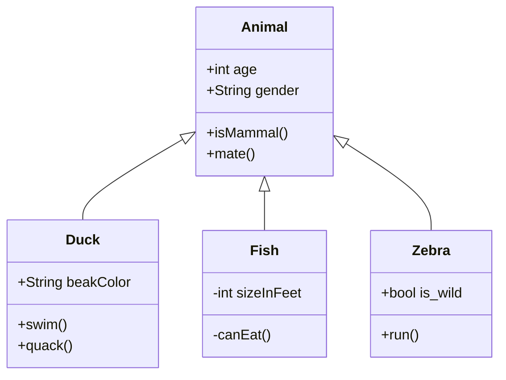
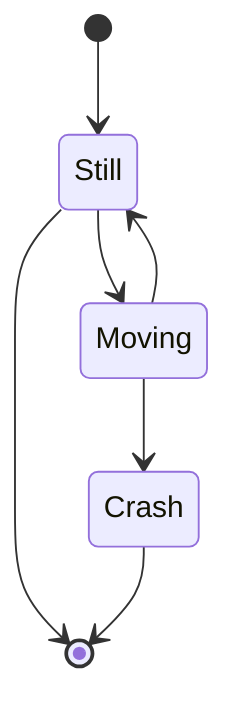
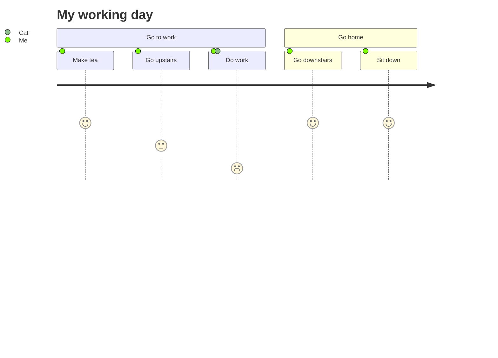
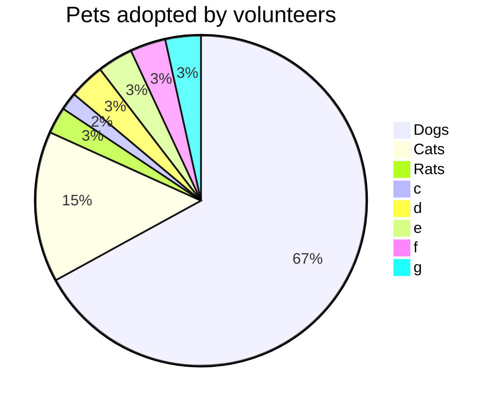
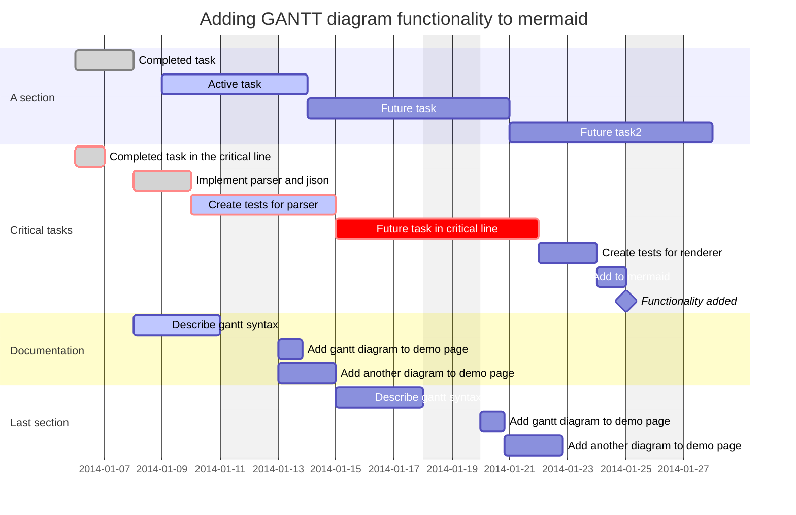
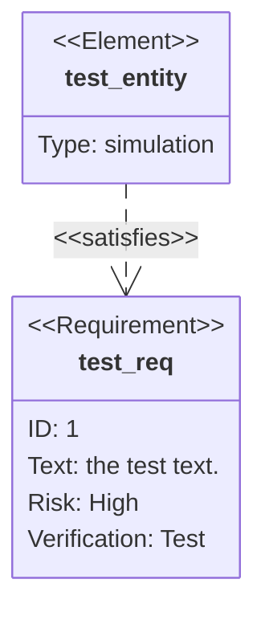

# Mermaid

markdown 流程图绘制库， `typora`内置支持该markdown代码块功能

[在线编辑器](https://mermaid-js.github.io/mermaid-live-editor/edit#eyJjb2RlIjoiZ3JhcGggVERcbiAgICBBW0hhcmRdIC0tPnxUZXh0fCBCKFJvdW5kKVxuICAgIEIgLS0-IEN7RGVjaXNpb259XG4gICAgQyAtLT58T25lfCBEW1Jlc3VsdCAxXVxuICAgIEMgLS0-fFR3b3wgRVtSZXN1bHQgMl0iLCJtZXJtYWlkIjoie1xuICBcInRoZW1lXCI6IFwiZGVmYXVsdFwiXG59IiwidXBkYXRlRWRpdG9yIjpmYWxzZSwiYXV0b1N5bmMiOnRydWUsInVwZGF0ZURpYWdyYW0iOnRydWV9)

## 功能

代码块为`mermaid`, 比如
<pre>

</pre>

### FlowChart - 流程图

### Sequence Diagram - 时序图

### Class Diagram - 类图

### State Diagrams - 状态图

### User Journey Diagrams - 用户旅程图

### Pie Chart Diagrams - 饼图

### Gantt Diagrams - 甘特图

### Requirement Diagrams - 需求图

## 配置

我们可以通过配置`mermaid.initialize(config)`方法中的config来配置全局图表的样式

你可以在这里找到全部的配置项 -> [Mermaid官网 - 全部配置项](https://mermaid-js.github.io/mermaid/#/./Setup?id=mermaidapi-configuration-defaults)

你也可以使用[Mermaid在线编辑器](https://mermaid.live/edit#eyJjb2RlIjoiZ3JhcGggTFJcbiAgICB0aGVtZSA9PT4gdChuZXV0cmFsKVxuICAiLCJtZXJtYWlkIjoie1xuICBcInRoZW1lXCI6IFwibnVsbFwiXG59IiwidXBkYXRlRWRpdG9yIjpmYWxzZSwiYXV0b1N5bmMiOnRydWUsInVwZGF0ZURpYWdyYW0iOmZhbHNlfQ)进行配置项测试

### `theme`

主题, 可选值为

+ `default`

  

+ `forest`

  

+ `dark`

  

+ `neutral`

  

+ `base`

  

+ `null`

  禁用所有预设主题

