# 待整理

## APP实例

首先,我们先了解一下Vue实例(App对象)所包含的属性以及方法.

控制台输出的`createApp()`创建的Vue实例对象


## CreateApp

`CreateApp`是Vue3的实例创建方法, 方法定义在`runtime-dom/src/index.ts`

方法主要调用流程如下:

```mermaid
graph LR;
	subgraph createApp
	ensureRenderer --实际调用--> baseCreateRenderer --返回createApp--> E[调用createApp]
	end
```



1. 调用 `ensureRenderer` 方法来创建渲染器(单例)

   创建渲染器.`runtime-core/src/renderer.ts` 的 `baseCreateRenderer` 方法

   `baseCreateRenderer`方法主要定义了**补丁(patch)方法**以及**一些vNode操作方法**

   <details>
     <summary>定义方法一览</summary>
     <ul>
       <li>补丁方法
         <ul>
           <li>patch</li>
           <li>patchChildren</li>
       		<li>patchBlockChildren</li>
         </ul>
       </li>
       <li>vNode操作
         <ul>
           <li>unmount</li>
           <li>move</li>
           <li>remove</li>
           <li>mountComponent</li>
           <li>mountChildren</li>
         </ul>
       </li>
       <li>getNextHostNode</li>
       <li>options(包含一些dom操作方法的对象)</li>
       <li><b>render(渲染方法, 会传给<code>createAppApi</code>)</b></li>
     </ul>
   </details>

2. 调用`createAppAPI中的createApp`方法来创建Vue实例对象

   实则调用`runtime-core/src/apiCreateApp.ts`中的`createAppAPI`的返回值`createApp`方法来创建实例对象

   该方法主要内容是

   + 初始化Vue实例对象(定义对象以及一些操作方法)
   + 初始化安装的插件
   + 初始化挂载标识(`isMounted=false`)

   

3. 重写第二步创建好的Vue实例对象的`mount`方法

   1. 调用`normalizeContainer`方法来标准化容器
   2. 如果组件对象没有定义`render`函数和`template`模板，则取容器的`innerHTML` 作为组件模板内容
   3. 清空容器内容(`innerHTML = ''`)
   4. 调用原始`mount`方法作为方法返回值
   5. 移除容器`v-cloak`属性
   6. 为容器设置`data-v-app`属性, 表明元素是一个Vue实例容器

4. Vue实例创建完成, 等待调用`mount`方法进行挂载

## Mount(原始版本)

调用完`createApp`创建Vue实例后最终需要挂载到指定元素上, 调用`mount`方法并传入目标容器来进行挂载操作.

```mermaid
graph TD
	normalizeContainer --> M(调用原始mount方法)
	subgraph mount
	M --> cv(createVNode)
	end
	subgraph createVNode
	cv --> q{isVNode}
	q --Y--> cloneVNode --cloned&#40克隆的VNode&#41--> hc{hasChildren} 
	hc --Y--> normalizeChildren --> return&#32cloned
	hc --N--> return&#32cloned
	q --N--> isCP{isClassComponent}
	end
	M --> render
	
```




1. 创建VNode对象
2. 将app对象存储在vNode对象上
3. 进行渲染(调用`render`)
4. 设置挂载标识(`isMounted`)为`true`
5. 缓存根节点容器(`rootContainer`)
6. 通过`__vue_app__`属性为`devtools`暴露vue实例


## Render

首先, 我们来看一下render方法的定义

```typescript
const render = (vnode, container, isSVG) => {
  // 如果vnode为空， 则表明元素被清空
  if (vnode == null) {
    // 如果容器之前挂载过vNode，则卸载之前挂载的vNode
    if (container._vnode) {
      unmount(container._vnode, null, null, true);
    }
  }
  else {
    // 如果有vNode， 即容器内元素变化，打补丁(patch 方法由ensureRenderer定义)
    patch(container._vnode || null, vnode, container, null, null, null, isSVG);
  }
  // 刷新后置任务
  flushPostFlushCbs();
  // 更新vNode绑定
  container._vnode = vnode;
};
```

`render`方法接收三个参数`(vnode, container, isSVG)`

+ vNode: 待渲染的vNode
+ container: 渲染容器
+ isSVG: 是否是SVG

1. 判断是否有需要渲染的vNode, 

   + 如果没有, 则卸载之前容器挂载过的vNode(如果存在的话)

   + 如果有, 则调用补丁方法来为容器更新节点

2. 冲洗后置任务队列(`flushPostFlushCbs`)
3. 为容器更新`_vnode`属性

## Patch

补丁方法

```mermaid
graph LR
	A(Start) --> equal{新旧vNode相同?}
	equal --> |是| 结束
	equal --> |否| same{有旧节点, 且新旧不是相同类型?}
	same --> |否| TODO --> judge
	same --> |是| judge[根据节点类型进行响应处理]
```


1. 判断是否是相同节点, 如果相同则直接退出
2. 如果有容器有旧节点, 并且新节点与旧节点类型不同, 则将**锚点**设置为旧节点的下一个节点并卸载旧节点
3. 判断新节点类型, 根据不同的节点类型来进行不同处理
   + Text: 
   + Comment:
   + Static:
   + Fragment:
   + Others:
     + Element:
     + Component
       + 继承slotScopeIds
       + 如果原容器没有节点
         + 如果不是keepAlive, 则挂载节点([mountComponent](##mountComponent))
         + 如果是keepAlive, 则`activate`
       + 原容器有节点, 则更新组件(`updateComponent`)
     + Teleport:
     + Suspense:

4. 如果有`ref`则调用`setRef`来设置ref

## mountComponent

挂载组件方法, 方法大致流程以及操作如下

1. 创建组件实例
2. 如果是keepAlive组件则更新renderer
3. 设置组件([setupComponent](##setupComponent))
   1. 设置`props`, `attrs`
   2. 设置`slots`
   3. **如果是有状态组件,且有组件有`setup`方法, 则执行`setup`**
4. 设置渲染器影响(`setupRenderEffect`)
   1. 定义组件更新方法
   2. 为渲染过程创建响应式影响对象


## createComponentInstance

创建组件实例方法, 组件实例的定义如下

```typescript
const instance: ComponentInternalInstance = {
    uid: uid++,
    vnode,
    type,
    parent,
    appContext,
    root: null!, // to be immediately set
    next: null,
    subTree: null!, // will be set synchronously right after creation
    update: null!, // will be set synchronously right after creation
    scope: new EffectScope(true /* detached */),
    render: null,
    proxy: null,
    exposed: null,
    exposeProxy: null,
    withProxy: null,
    provides: parent ? parent.provides : Object.create(appContext.provides),
    accessCache: null!,
    renderCache: [],

    // local resovled assets
    components: null,
    directives: null,

    // resolved props and emits options
    propsOptions: normalizePropsOptions(type, appContext),
    emitsOptions: normalizeEmitsOptions(type, appContext),

    // emit
    emit: null!, // to be set immediately
    emitted: null,

    // props default value
    propsDefaults: EMPTY_OBJ,

    // inheritAttrs
    inheritAttrs: type.inheritAttrs,

    // state
    ctx: EMPTY_OBJ,
    data: EMPTY_OBJ,
    props: EMPTY_OBJ,
    attrs: EMPTY_OBJ,
    slots: EMPTY_OBJ,
    refs: EMPTY_OBJ,
    setupState: EMPTY_OBJ,
    setupContext: null,

    // suspense related
    suspense,
    suspenseId: suspense ? suspense.pendingId : 0,
    asyncDep: null,
    asyncResolved: false,

    // lifecycle hooks
    // not using enums here because it results in computed properties
    isMounted: false,
    isUnmounted: false,
    isDeactivated: false,
    bc: null,
    c: null,
    bm: null,
    m: null,
    bu: null,
    u: null,
    um: null,
    bum: null,
    da: null,
    a: null,
    rtg: null,
    rtc: null,
    ec: null,
    sp: null
  }
```

该方法主要定义上面👆这个对象,对以下属性赋值并将实例对象(instance)返回

+ ctx: `{ _: instance }`
+ root: 有父组件则使用父组件的`root`, 否则使用自己(`instance`)
+ emit: emit方法

## 响应式

`createReactiveObject`

`packages/reactivity/src/reactive.ts`

只有以下类型对象可以进行转化为响应式对象(Proxy)

+ Object
+ Array
+ Map
+ Set
+ WeakMap
+ WeakSet


以下类型对象无法进行转化

+ 有真值的`__v_skip`属性
+ 有真值的`__v_raw`属性
+ 有真值的`__v_isReactive`属性
+ 有真值的`__v_isReadonly`属性


1. 如果有对应缓存则直接返回缓存proxy对象

2. 根据对象是`集合(collection)`还是`普通对象(common)`来设置不同的代理处理方法

3. 以原始对象为key,代理对象为value放入代理表(`proxyMap`)进行缓存


## SetupComponent

方法定位: `packages/runtime-core/src/component.ts`

该方法用于初始化组件设置

`initProps`: 初始化组件的`props`和`attrs`

`initSlots`: 初始化组件的插槽

如果是有状态的组件, 则调用[setupStatefulComponent](##setupStatefulComponent)


## setupStatefulComponent

方法定位: `packages/runtime-core/src/component.ts`

初始化有状态组件

1. 初始化渲染函数代理属性访问缓存(`accessCache`)
2. 创建一个不被观测的组件实例上下文(`instance.ctx`)代理对象
3. 如果组件有配置`setup`
   1. 初始化setup上下文
   2. 设置当前实例(开启影响范围)
   3. 暂停跟踪
   4. 调用实例`setup`方法
   5. 恢复跟踪
   6. 取消当前实例设置
   7. 处理setup结果([handleSetupResule](##handleSetupResule))
4. 没有配置`setup`就结束组件配置(调用`finishComponentSetup`来进行模板编译)


## handleSetupResult

调用[finishComponentSetup](##finishComponentSetup)

## finishComponentSetup

1.如果组件实例没定义`render`

获取组件模板(`template`)以及编译器配置, 调用编译方法([compile](##compileToFunction))将编译完成的对象作为组件的`render`方法

2. 构建实例的代理对象

3. 应用组件选项[applyOptions](##applyOptions)

## compileToFunction

方法位置: `packages/vue/src/index.ts`的`compileToFunction`

方法接收两个参数`template(模板)`与`options(编译器选项)`

1. 以模板为key查找缓存
2. 如果模板字符串以`#`开头,则作为ID选择器进行元素查找
   + 如果找到则使用元素的`innerHTML`作为模板
   + 没找到则使用空字符串作为模板
3. 调用编译方法([compile](##compile))来编译模板字符串


## compile

方法位置: `packages/compiler-dom/src/index.ts`

方法返回实质调用[baseCompile](##baseCompile)


## baseCompile

方法位置: `packages/compiler-core/src/compile.ts`

1. 调用[baseParse](##baseParse)将字符串模板转化为AST(抽象语法树)
2. 


## baseParse

方法位置: `packages/compiler-core/src/parse.ts`

字符串模板解析方法

1. 创建解析环境(`createParserContext`)
2. 获取解析开始位置(`getCursor`)
3. 创建根节点(`createRoot`)


## parseChildren


## applyOptions

文件位置: `packages/runtime-core/src/componentOptions.ts`

组件选项初始化顺序:

1. `props(在该方法外就早已完成初始化, 待查明具体方法)`
2. `inject`
3. `methods`
4. `data(直到它依赖this访问)`
5. `computed`
6. `watch(直到它依赖this访问)`


1. 解析合并组件选项

2. 检查是否有重复定义的属性

3. 如果有方法(`methods`)定义, 则遍历方法为每个方法更新`this`指向(使用`bind`绑定当前组件代理对象)

4. 如果有`data`方法定义, 使用`call(publicThis, publicThis)`来绑定到当前实例代理对象上?TODO

5. 将`data`调用`reactive`转化为响应式对象并赋值给组件实例

6. 如果有计算属性(`computed`)

   如果是方法, 则更新this指向

7. 如果有`watch`定义, 则调用`createWatcher`来创建`watcher`
