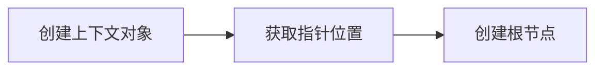
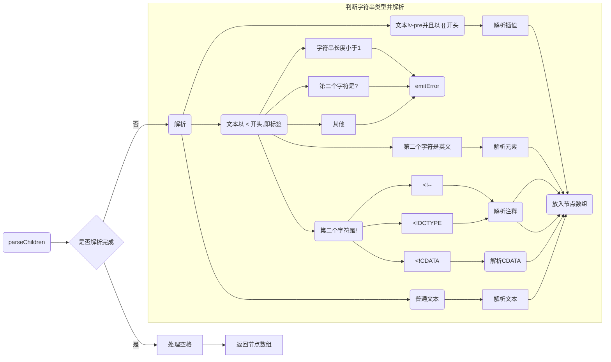
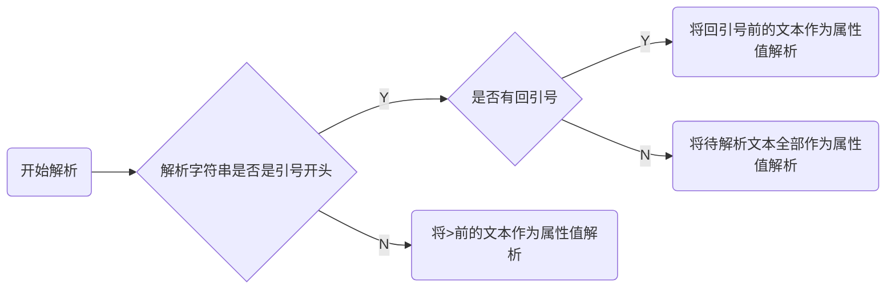

# Parse - 解析

## 解析过程

解析过程是将**字符串模板**解析为Vue`AST`对象





**方法定义:**

```typescript
export function baseParse(
  content: string,
  options: ParserOptions = {}
): RootNode {
  const context = createParserContext(content, options)
  const start = getCursor(context)
  return createRoot(
    parseChildren(context, TextModes.DATA, []),
    getSelection(context, start)
  )
}
```

1. **创建解析上下文对象(`createParserContext`**)

   该对象在解析过程中全程参与, 主要用于记录当前解析进度信息.

   该对象在代码中的定义如下:

   ```typescript
   export interface ParserContext {
     // 解析器选项
     options: MergedParserOptions
     // 原始字符串模板
     readonly originalSource: string
     // 当前剩余待解析字符串模板
     source: string
     // 偏移量
     offset: number
     // 行数
     line: number
     // 列数
     column: number
     // 是否是在`<pre>`标签内, 保留空格
     inPre: boolean // HTML <pre> tag, preserve whitespaces
     // 是否是在`v-pre`指令所在的标签内, 不处理指令和插值
     inVPre: boolean // v-pre, do not process directives and interpolations
     onWarn: NonNullable<ErrorHandlingOptions['onWarn']>
   }
   ```


2. **获取当前解析进度下指针位置(`getCursor`)**

   该方法其实就是返回上下文对象中的`column`, `line`, `offset`属性值

   ```typescript
   function getCursor(context: ParserContext): Position {
     const { column, line, offset } = context
     return { column, line, offset }
   }
   ```

   

3. **创建根节点(`createRoot`)**

   创建`type`是`NodeTypes.ROOT`的根节点对象, 传入调用`parseChildren`方法解析好的子节点作为`children`

   Vue3的`template`可以支持多个根节点是因为该方法将`template`内所有的节点都当做`children`挂载到这个虚拟的根节点上.
   
   ```typescript
   export function createRoot(
     children: TemplateChildNode[],
     loc = locStub
   ): RootNode {
     return {
       type: NodeTypes.ROOT,
       children,
       helpers: [],
       components: [],
       directives: [],
       hoists: [],
       imports: [],
       cached: 0,
       temps: 0,
       codegenNode: undefined,
       loc
     }
   }
   ```


由上面步骤我们可以看出, 解析过程的主要工作是在`parseChildren`

## TextModes

在看`parseChildren`方法之前, 我们先来看下`TextModes`的种类以及定义

```typescript
export const enum TextModes {
  //          |   元素		| 实 体     | 结束标识   		  | 包括
  DATA, //    | ✔        | ✔        | 祖先节点				 |
  RCDATA, //  | ✘        | ✔        | 父节点					 | <textarea>
  RAWTEXT, // | ✘        | ✘        | 父节点					 | <style>,<script>
  CDATA,
  ATTRIBUTE_VALUE
}
```

+ `DATA`: 
+ `RCDATA`: 如`<textarea>`
+ `RAWTEXT`: 原始文本元素, 如`<style>`, `<script>`
+ `CDATA`: CDATA文本
+ `ATTRIBUTE_VALUE`: 属性值

## parseChildren

方法定义为: `parseChildren(context, mode, ancestors)`, 接收三个参数

`parse`调用`parseChildren`所传入的参数是`context`, `TextModes.DATA`, `[]`, 返回解析好的子节点嵌套对象数组`nodes`

### 解析规则

由于原代码较长, 此处删减部分源代码只表明大体意图

```typescript
function parseChildren(
  context: ParserContext,
  mode: TextModes,
  ancestors: ElementNode[]
): TemplateChildNode[] {
  const parent = last(ancestors)
  const ns = parent ? parent.ns : Namespaces.HTML
  const nodes: TemplateChildNode[] = []
  // 字符串解析规则
  while (!isEnd(context, mode, ancestors)) {
    const s = context.source
    let node: TemplateChildNode | TemplateChildNode[] | undefined = undefined
    if (mode === TextModes.DATA || mode === TextModes.RCDATA) {
      if (!context.inVPre && startsWith(s, context.options.delimiters[0])) {}
      else if (mode === TextModes.DATA && s[0] === '<') {
        if (s.length === 1) {}
        else if (s[1] === '!') {
          if (startsWith(s, '<!--')) {}
          else if (startsWith(s, '<!DOCTYPE')) {}
          else if (startsWith(s, '<![CDATA[')) {}
          else {}
        } else if (s[1] === '/') {
          if (s.length === 2) {} 
          else if (s[2] === '>') {}
          else if (/[a-z]/i.test(s[2])) {}
          else {}
        } else if (/[a-z]/i.test(s[1])) {}
        else if (s[1] === '?') {}
        else {}
      }
    }
  }
  if (!node) { node = parseText(context, mode) }
  if (isArray(node)) {
    for (let i = 0; i < node.length; i++) {
      pushNode(nodes, node[i])
    }
  } else {
    pushNode(nodes, node)
  }
  let removedWhitespace = false
  // ...省略处理空字符逻辑
  return removedWhitespace ? nodes.filter(Boolean) : nodes
}
```

### 流程图



根据字符串命中不同的判断规则, 一共有以下几种解析方式

+ [`parseInterpolation`](###parseInterpolation - 解析插值): 解析插值(字符串以**插值符号或者是用户自定义插值**开头)
+ [`parseBogusComment`](###parseBogusComment - 解析文档声明): 解析文档声明(字符串以`<!DOCTYPE`开头), 返回注释类型节点(`NodeTypes.COMMENT`)
+ `parseComment`: 解析注释(字符串以`<!--`开头), 返回注释类型节点(`NodeTypes.COMMENT`)
+ `parseCDATA`: 解析CDATA(字符串以`<!CDATA[`开头), 使用节点内容递归调用`parseChildren`, 返回模板子节点数组
+ `parseTag`: 解析HTML标签(字符串以`</`开头后接英文字母的)
+ `parseElement`: 解析元素(字符串以`<`开头后接英文字母的)
+ `parseText`: 解析文本(以上几种都不符合的)


该方法不断循环解析字符串模板, 同时对模板上下文对象修改以更新解析进度.

在待解析字符串模板为空的时候返回解析后的节点对象数组


## 解析规则详情

### 工具函数

这些`advance`函数在解析过程中不断被用到, 用于**进行一些操作**并**更新解析指针位置**

+ `advanceBy`: 截取给定长度字符串(留下后面的字符串)
+ `advanceSpaces`: 截取空格
+ `advancePositionWithMutation`: 主要用于更新解析指针位置, 上面两个函数更新指针位置的操作就是通过调用该函数


### parseText - 解析文本

1. 获取解析结束标识
2. 找到字符串中**第一个**结束标识位置
3. 截取到结束标识位置之前的字符串(通过调用`parseTextData`)
4. 返回`NodeTypes.TEXT`类型的文本节点


### ParseElement - 解析HTML标签元素

1. 获取父元素
2. 解析标签元素[parseTag](###ParseTag - 解析标签)
3. 如果元素是自闭合标签或者是空标签, 则直接返回第2步解析好的标签元素
4. 将解析好的标签元素对象放入**祖先栈(`ancestors`)**中
5. 将解析好的标签元素作为参数(父元素)调用[parseChildren](##parseChildren)来解析子元素[^1]
6. 将父标签元素出栈(`ancestors.pop()`)
7. 将子元素赋值给解析的标签元素
8. 设置元素位置信息`loc`
9. 返回解析好的元素


[^1]: 不断对`ancestors`进行出栈入栈来匹配标签

> 比如字符串模板为`<div><span></span></haha>`, 进行解析
>
> 那么`ancestors`的数据变化将会是
>
> 1. 解析`div`   --> [div]
> 2. 解析`span`  --> [div,span]
> 3. 解析`/span` --> [div]
> 4. 解析`/haha` --> [div] => 报错, 因为 div !== haha 导致标签解析(parseTag)失败


### ParseTag - 解析标签

比如`<div class="demo"></div>`

1. 通过正则获取标签类型
2. 更新并获取指针位置, 同时更新待解析字符串
3. 检查是否是`<pre>`标签
4. 解析标签属性(`parseAttributes`)
   1. 初始化属性数组
   2. 前进指针解析字符串, 直到遇到结束标签(`>`, `/>`)
      1. 解析标签属性值[parseAttribute](##ParseAttribute - 解析HTML元素标签属性)
      2. [为`class`属性调整空格(`trim`)]( https://github.com/vuejs/vue-next/issues/4251)
      3. 将解析好的属性对象放入结果数组
      4. 移除空格前进指针
   3. 返回属性数组
5. 检查`v-pre`
6. 根据是否是自闭合标签来将指针前进`2`或`1`
7. 如果标签是`slot`,`template`或者是Vue组件, 更新标签类型值
8. 返回解析好的对象


### parseAttributes - 解析HTML元素标签属性以及校验

不断调用[parseAttribute]()来解析当前标签元素属性直到待解析模板长度为0或者当前标签结束(`>`, `/>`)

返回解析到的属性节点数组

### ParseAttribute - 解析HTML元素标签属性

1. 通过正则获取属性名
2. 判断是否有重名属性, 有则报错
3. 定义初始化属性值为`undefined`
4. 通过正则判断是否含有属性值
   1. 如果有, 解析模板获取属性值[parseAttributeValue](###ParseAttributeValue - 解析HTML元素标签属性值)
   2. 如果解析属性值结果为空值, 则认为解析失败(如`class=`), 报错
5. 处理Vue简写字段, 如[`v-`, `:`, `@`, `#`, `.`, `[`]开头的属性, 返回`NodeTypes.DIRECTIVE`类型指令节点
6. 返回`NodeTypes.ATTRIBUTE`类型属性节点


### ParseAttributeValue - 解析HTML元素标签属性值




### parseInterpolation - 解析插值

1. 获取插值开闭定界符, 默认为`\{\{`, `\}\}`

2. 获取定界符的位置, 截取字符串得到定界符内文本
3. 返回`NodeTypes.INTERPOLATION`类型插值节点

比如`\{\{ demo \}\}`

```typescript
return {
    type: NodeTypes.INTERPOLATION,
    content: {
      type: NodeTypes.SIMPLE_EXPRESSION,
      isStatic: false,
      constType: ConstantTypes.NOT_CONSTANT,
      content: 'demo',
      loc: getSelection(context, innerStart, innerEnd)
    },
    loc: getSelection(context, start)
  }
```


### parseBogusComment - 解析文档声明

1. 获取标签结束符位置(`>`)
2. 截取内容`content`
3. 返回`NodeTypes.COMMENT`类型注释节点

比如`<!DOCTYPE html>`

```typescript
return {
  type: NodeTypes.COMMENT,
  content: 'html',
  loc
}
```


### parseComment - 解析注释

1. 检验是否有结束标识`-->`
2. 截取注释内容`content`
3. 返回`NodeTypes.COMMENT`类型注释节点

比如`<!--comment-->`

```typescript
return {
  type: NodeTypes.COMMENT,
  content: 'comment',
  loc
}
```

